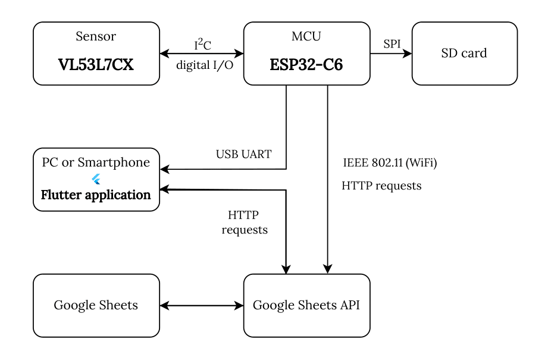

# Detecting-number-of-people
Automated system for detecting the number of people in a room using sensors.

It is a part of [bachelor thesis](https://www.vut.cz/en/students/final-thesis/detail/167854).

## Software for ESP32-C6
Software in ESP-IDF for ESP32-C6 MCU. It controlls IR ToF sensor VL53L7CX and uploads data to Google Sheets.

[More information](ESP32-C6-Sensor/README.md)

## Application in Flutter

An application for visualization of data.

[More information](/Flutter-sensor_gui/README.md)

